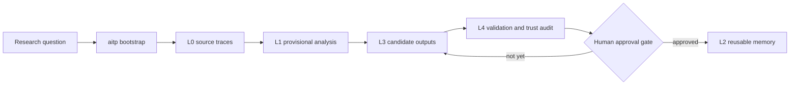

<div align="center">
  
  <h1>AITP Research Charter and Kernel</h1>
  <p><strong>A research protocol that turns your AI coding agent into a disciplined theoretical-physics collaborator — one that keeps evidence separate from conjecture, remembers your topics across sessions, and only promotes results to trusted memory after you approve them.</strong></p>
  <p>
    <a href="#how-it-works">How it works</a> ·
    <a href="#installation">Installation</a> ·
    <a href="#the-basic-workflow">Workflow</a> ·
    <a href="#research-model">Research Model</a> ·
    <a href="#whats-inside">What's Inside</a> ·
    <a href="#philosophy">Philosophy</a> ·
    <a href="#read-next">Docs</a>
  </p>
</div>

<p align="center">
  
</p>

<p align="center">
  <a href="https://github.com/bhjia-phys/AITP-Research-Protocol/stargazers"></a>
  <a href="https://github.com/bhjia-phys/AITP-Research-Protocol/network/members"></a>
  <a href="https://github.com/bhjia-phys/AITP-Research-Protocol/issues"></a>
  <a href="./LICENSE"></a>
  
  
</p>

## How it works

It starts when you describe what you want to study — in plain language, the way you would explain it to a colleague. AITP takes that description and turns it into a bounded research topic with a clear question, scope, and validation plan. You don't need to learn any special commands; just talk.

Once the topic is set up, your AI agent does the actual research work — gathering sources, reading papers, sketching derivations, or running benchmarks — inside a layered protocol that keeps every piece of evidence traceable. Exploratory notes and tentative claims stay clearly labeled as such. Nothing gets promoted to "trusted" status just because the agent sounds confident.

When the work reaches a natural checkpoint, AITP presents what it found, what gaps remain, and whether the results are ready for your review. You decide what gets promoted to reusable memory. This is the human gate — the agent executes, but you own the trust decisions.

Everything is durable. You can close your laptop, come back days later, say "continue this topic," and the agent picks up exactly where it left off — with full context of what was done, what was decided, and what is still open. For the full experience, see [`docs/USER_TOPIC_JOURNEY.md`](docs/USER_TOPIC_JOURNEY.md).

## Installation

### Quick Start

```bash
python -m pip install aitp-kernel
aitp --version
aitp doctor
```

Then install the platform adapter you use:

### Codex (recommended)

```bash
aitp install-agent --agent codex --scope user
```

See [`.codex/INSTALL.md`](.codex/INSTALL.md) for details.

### OpenCode

Add to your `opencode.json`:

```json
{ "plugin": ["aitp@git+https://github.com/bhjia-phys/AITP-Research-Protocol.git"] }
```

See [`.opencode/INSTALL.md`](.opencode/INSTALL.md) for details.

### Claude Code

```bash
aitp install-agent --agent claude-code --scope user
```

See [`docs/INSTALL_CLAUDE_CODE.md`](docs/INSTALL_CLAUDE_CODE.md) for details.

### OpenClaw

```bash
aitp install-agent --agent openclaw --scope user
```

See [`docs/INSTALL_OPENCLAW.md`](docs/INSTALL_OPENCLAW.md) for details.

For contributor/local-dev editable installs, Windows-specific instructions,
migration from older installs, and troubleshooting, see
[`docs/INSTALL.md`](docs/INSTALL.md).

## The Basic Workflow

1. **Topic bootstrap** — You describe what you want to study. AITP sets up a research topic with a bounded question, scope, and validation contract. No special commands needed.

2. **Source acquisition (L0)** — AITP gathers papers, notes, and upstream references. Everything is traceable back to its origin.

3. **Analysis and exploration (L1, L3)** — The agent reads, annotates, sketches derivations, or runs benchmarks. Exploratory outputs are clearly labeled as candidates, not conclusions.

4. **Validation and trust audit (L4)** — When results look promising, AITP runs explicit checks — consistency, convergence, reproduction — before asking whether the work is ready.

5. **Promotion to reusable memory (L2)** — Only after your explicit approval does material move into long-term trusted memory. The agent cannot promote on its own.

## Research Model

AITP keeps research state in layers instead of flattening everything into one chat transcript.

| Layer | Purpose | What goes here |
| --- | --- | --- |
| **L0** | Source acquisition | papers, notes, upstream code references |
| **L1** | Provisional understanding | analysis notes, derivation sketches |
| **L3** | Exploratory outputs | candidate claims, tentative material |
| **L4** | Validation and trust audit | checks, benchmarks, human decisions |
| **L2** | Long-term trusted memory | promoted knowledge, reusable workflows |

The default route is `L0 → L1 → L3 → L4 → L2`. Layer 2 is intentionally last — exploratory work does not become reusable memory just because the agent sounds confident.



## What's Inside

### Three Research Lanes

The same protocol kernel drives different categories of theoretical-physics work.

| Lane | Typical inputs | Validation | Trusted output |
| --- | --- | --- | --- |
| **Formal theory and derivation** | papers, definitions, prior claims | proof-gap analysis, consistency checks | semi-formal theory objects, Lean-ready packets |
| **Toy-model numerics** | model specs, observables, scripts | convergence checks, benchmarks | validated workflows, reusable operations |
| **Code-backed algorithm development** | upstream codebases, existing methods | reproduction, trust audit | trusted methods, backend writeback |

### Capabilities

- **Multi-topic runtime** — Work on several research topics in one workspace. Switch between them with natural language.
- **Cross-session memory** — Every topic survives session resets. Resume days later with full context.
- **Lean-ready export** — Bridge validated theory results into Lean 4 declaration packets with proof-obligation sidecars.
- **Bounded autonomous execution** — Run multi-step research loops with explicit human gates at decision points (OpenClaw).

### Runtime Support

| Runtime | Install path | Role |
| --- | --- | --- |
| **Codex** | [`.codex/INSTALL.md`](.codex/INSTALL.md) | Baseline — cleanest end-to-end experience |
| **OpenCode** | [`.opencode/INSTALL.md`](.opencode/INSTALL.md) | Plugin-based natural-language routing |
| **Claude Code** | [`docs/INSTALL_CLAUDE_CODE.md`](docs/INSTALL_CLAUDE_CODE.md) | SessionStart bootstrap |
| **OpenClaw** | [`docs/INSTALL_OPENCLAW.md`](docs/INSTALL_OPENCLAW.md) | Bounded autonomous research loops |

Run `aitp doctor --json` to check what is converged on your machine.

Current baseline: Codex.
Parity target: Claude Code and OpenCode.
Specialized lane: OpenClaw.

The machine-readable install view exposes:

- `runtime_convergence`
- `full_convergence_repair`
- `runtime_support_matrix.runtimes.<runtime>.remediation`

Windows local-checkout note:

- `scripts\aitp-local.cmd doctor`
- `scripts\aitp-local.cmd bootstrap --topic "<topic>" --statement "<statement>"`

Useful runtime audit entrypoints once a topic exists:

- `aitp capability-audit --topic-slug <topic_slug>`
- `aitp paired-backend-audit --topic-slug <topic_slug>`
- `aitp h-plane-audit --topic-slug <topic_slug>`

## Philosophy

- **Evidence before confidence** — sources stay separate from speculation at every layer
- **Bounded steps, not freestyle** — every unit of work has a clear question and scope
- **Humans own trust** — nothing becomes reusable memory without explicit approval
- **Durable by default** — research state survives session resets and machine changes
- **Light until it matters** — ordinary work stays minimal; the runtime only expands when something important happens

## Current Status

- Ships a standalone installable kernel under `research/knowledge-hub`
- Supports Codex, OpenCode, Claude Code, and OpenClaw front doors
- Multi-topic runtime with natural-language switching
- Explicit human approval gate before L2 promotion
- Bridges into the [Theoretical-Physics-Knowledge-Network](https://github.com/bhjia-phys/Theoretical-Physics-Knowledge-Network) formal-theory backend

In progress: expanding multi-runtime smoke testing and shrinking the compatibility installer as native platform installs mature.

## Contributing

AITP stabilizes the research protocol, not one frozen implementation. Contributions that preserve the layer model, durable artifacts, evidence boundaries, and governed promotion gates are welcome.

See [`docs/CHARTER.md`](docs/CHARTER.md) for what counts as disciplined AI-assisted theoretical-physics work.
See [`docs/AITP_GSD_WORKFLOW_CONTRACT.md`](docs/AITP_GSD_WORKFLOW_CONTRACT.md)
for the boundary between research-topic work in AITP and implementation work
in GSD.

## License

MIT License — see [`LICENSE`](LICENSE) file for details.

## Read Next

- [`docs/QUICKSTART.md`](docs/QUICKSTART.md) — detailed walkthrough with a real topic
- [`docs/USER_TOPIC_JOURNEY.md`](docs/USER_TOPIC_JOURNEY.md) — what AITP feels like in practice
- [`docs/INSTALL.md`](docs/INSTALL.md) — all installation details and troubleshooting
- [`docs/PUBLISH_PYPI.md`](docs/PUBLISH_PYPI.md) — public package build and release workflow
- [`docs/CHARTER.md`](docs/CHARTER.md) — the full research charter
- [`docs/architecture.md`](docs/architecture.md) — technical architecture
- [`docs/MULTI_TOPIC_RUNTIME.md`](docs/MULTI_TOPIC_RUNTIME.md) — multi-topic runtime behavior
- [`docs/MIGRATE_MULTI_TOPIC.md`](docs/MIGRATE_MULTI_TOPIC.md) — migration notes for multi-topic state
- [`research/knowledge-hub/L5_PUBLICATION_FACTORY_PROTOCOL.md`](research/knowledge-hub/L5_PUBLICATION_FACTORY_PROTOCOL.md) — publication/output layer contract
- [`docs/AITP_GSD_WORKFLOW_CONTRACT.md`](docs/AITP_GSD_WORKFLOW_CONTRACT.md) — when to use AITP vs GSD
- [`docs/AITP_WORKFLOW_SHELL_AND_PROTOCOL_KERNEL.md`](docs/AITP_WORKFLOW_SHELL_AND_PROTOCOL_KERNEL.md) — why the UX converges on Superpowers' install shape
- [`docs/roadmap.md`](docs/roadmap.md) — development roadmap
