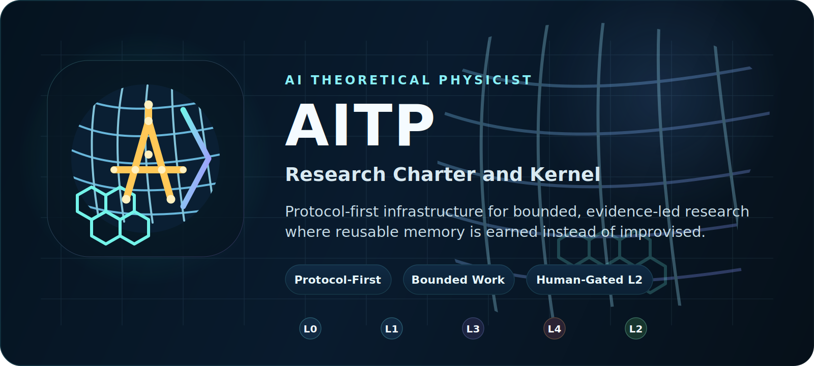
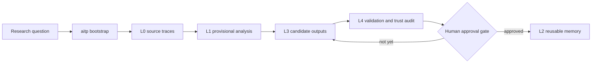

<div align="center">
  
  <h1>AITP Research Charter and Kernel</h1>
  <p><strong>Protocol-first infrastructure for building an AI Theoretical Physicist that behaves like a disciplined research participant rather than a free-form chat agent.</strong></p>
  <p>
    <a href="#quick-start">Quick Start</a> ·
    <a href="#research-model">Research Model</a> ·
    <a href="#how-you-actually-use-it">Usage</a> ·
    <a href="#runtime-support-matrix">Runtime Support</a> ·
    <a href="#read-next">Docs</a>
  </p>
</div>

<p align="center">
  
</p>

<p align="center">
  <a href="https://github.com/bhjia-phys/AITP-Research-Protocol/stargazers"></a>
  <a href="https://github.com/bhjia-phys/AITP-Research-Protocol/network/members"></a>
  <a href="https://github.com/bhjia-phys/AITP-Research-Protocol/issues"></a>
  <a href="./LICENSE"></a>
  
  
</p>

> Charter above runtime. Protocol above heuristics. Agents are executors, not the source of truth.

AITP stabilizes the research protocol, not one frozen implementation. Agents
may use different scripts, prompts, and task decompositions, but they must
preserve the layer model, durable artifacts, evidence boundaries, and governed
promotion gates that make the work auditable and reusable.

## Why AITP

Large models can already write research-sounding prose. That is cheap.

AITP exists to enforce the parts that are not cheap:

- evidence stays separate from conjecture;
- bounded steps replace hidden freestyle workflows;
- reusable memory is earned instead of assumed;
- failed attempts and uncertainty remain visible;
- humans stay legitimate at high-impact decision points.

## What You Get

| Surface | What it does | Where it lives |
| --- | --- | --- |
| Charter | Defines what counts as disciplined AI-assisted theoretical-physics work | `docs/CHARTER.md`, `docs/AGENT_MODEL.md` |
| Protocol contracts | Defines durable artifacts, promotion gates, and trust boundaries | `contracts/`, `schemas/` |
| Standalone kernel | Ships the public `L0-L4` runtime, audits, and CLI/MCP surfaces | `research/knowledge-hub/` |
| Research-flow guardrails | Forces explicit research contracts, bounded action packets, and anti-proxy verification rules | `research/knowledge-hub/RESEARCH_EXECUTION_GUARDRAILS.md` |
| Adapters | Makes Codex, OpenClaw, Claude Code, and OpenCode enter through AITP | `adapters/`, `docs/INSTALL_*.md` |

## Quick Start

The fastest useful path is still the Codex path:

```bash
git clone git@github.com:bhjia-phys/AITP-Research-Protocol.git
cd AITP-Research-Protocol

python3 -m pip install -e research/knowledge-hub
aitp doctor
```

On Windows-native, the repo-local launchers work without WSL:

```cmd
scripts\aitp-local.cmd doctor
```

Then install the platform surface you actually use:

- Codex: follow [`./.codex/INSTALL.md`](.codex/INSTALL.md)
- OpenCode: follow [`./.opencode/INSTALL.md`](.opencode/INSTALL.md)
- Claude Code: follow [`docs/INSTALL_CLAUDE_CODE.md`](docs/INSTALL_CLAUDE_CODE.md)

If your system Python is externally managed:

```bash
python3 -m pip install --break-system-packages --user -e research/knowledge-hub
```

`aitp install-agent` still exists, but it is now the compatibility and
workspace-seeding path. The public default is the same shape as Superpowers:
skill discovery for Codex, plugin bootstrap for OpenCode, and SessionStart
bootstrap for Claude Code.

## Research Model

AITP keeps research state in layers instead of flattening everything into one
chat transcript.

| Layer | Purpose | Typical contents |
| --- | --- | --- |
| `L0` | Source acquisition and traceability | papers, notes, source maps, upstream code references |
| `L1` | Provisional understanding | analysis notes, derivation sketches, concept structure |
| `L3` | Exploratory but not yet trusted outputs | candidate claims, explanatory notes, tentative reusable material |
| `L4` | Validation and adjudication | baseline runs, trust audits, implementation checks, operator decisions |
| `L2` | Long-term trusted memory | promoted knowledge, reusable workflows, stable backends |

The default non-trivial route is:

`L0 -> L1 -> L3 -> L4 -> L2`

`L2` is intentionally last. Exploratory work does not become reusable memory
just because an agent sounds confident.



## How You Actually Use It

AITP currently has three public workflows that matter.

### 1. Codex With Native Skill Discovery

Use this when you want a normal `codex` conversation, but you want theory work
to route through AITP automatically.

```bash
# one-time install
git clone https://github.com/bhjia-phys/AITP-Research-Protocol.git ~/.codex/aitp
python -m pip install -e ~/.codex/aitp/research/knowledge-hub

# expose the skills
mkdir -p ~/.agents/skills
ln -s ~/.codex/aitp/skills ~/.agents/skills/aitp
```

Expected behavior:

- `codex` discovers `using-aitp` as the conversation-level gatekeeper;
- `codex` loads `aitp-runtime` only after AITP claims the task;
- natural-language requests such as `继续这个 topic，方向改成 X` route through the current-topic-first AITP entry path;
- it reads the runtime bundle before continuing;
- outputs stay in `L1`, `L3`, or `L4` until a human approves `L2` promotion.

Manual fallback:

```bash
aitp session-start "<task>"
```

The user experience target is natural language first. The user should not need
to remember wrappers or front-door shell commands.

### 2. OpenCode With Plugin Bootstrap

Use this when you want OpenCode to feel natural-language first, but still enter
AITP before substantive theory work.

```bash
# add the plugin to opencode.json
{
  "plugin": ["aitp@git+https://github.com/bhjia-phys/AITP-Research-Protocol.git"]
}
```

Expected behavior:

- the plugin registers the AITP `skills/` directory;
- the plugin injects `using-aitp` through `experimental.chat.system.transform`;
- natural-language requests route through the same current-topic-first AITP entry path used by Codex;
- outputs stay in `L1`, `L3`, or `L4` until a human approves `L2` promotion.

Manual fallback remains `aitp session-start "<task>"`, but the public default
is plugin bootstrap rather than `/aitp` command bundles.

### 3. Claude Code With SessionStart Bootstrap

Use this when you want Claude Code to enter AITP at conversation start instead
of relying on explicit slash commands.

Install the AITP Claude plugin or the compatibility hook bundle described in
[`docs/INSTALL_CLAUDE_CODE.md`](docs/INSTALL_CLAUDE_CODE.md).

Expected behavior:

- Claude Code receives `using-aitp` through SessionStart bootstrap;
- research requests route into AITP before any substantial response;
- current-topic continuation and steering updates stay natural-language first;
- `runtime_protocol.generated.md` remains the first runtime checklist after routing succeeds.

### 4. OpenClaw For Bounded Autonomous Research

Use this when you want bounded autonomous progress under heartbeat or
control-note constraints, without giving the runtime permission to invent its
own protocol.

```bash
# one-time user install
aitp install-agent --agent openclaw --scope user

# do one bounded step
aitp loop --topic-slug <topic_slug> --human-request "<task>" --max-auto-steps 1
```

If you want a workspace-local OpenClaw skill surface:

```bash
aitp install-agent --agent openclaw --scope project --target-root /path/to/openclaw-workspace
```

On Windows-native, the equivalent entrypoints are:

```cmd
scripts\aitp-local.cmd install-agent --agent openclaw --scope project --target-root D:\openclaw-workspace
scripts\install-openclaw-plugin-local.cmd --target-root D:\openclaw-workspace
```

Expected behavior:

- OpenClaw re-enters through `aitp loop`;
- it refreshes runtime state and decision surfaces;
- it performs one bounded next step and writes human-readable artifacts;
- anything destined for `L2` still waits for explicit human approval.

## Core Runtime Commands

If you remember only one command block, remember this one:

```bash
# install a runtime adapter
aitp install-agent --agent codex --scope user

# open a new topic
aitp bootstrap --topic "<topic>" --human-request "<task>"

# open a new topic with an explicit shell contract
aitp new-topic --topic "<topic>" --question "<bounded question>" --mode formal_theory

# materialize natural-language routing at session start
aitp session-start "<task>"

# do one bounded unit of work
aitp loop --topic-slug <topic_slug> --human-request "<task>" --max-auto-steps 1

# inspect the shell before continuing
aitp status --topic-slug <topic_slug>
aitp next --topic-slug <topic_slug>

# run one bounded shell-driven step
aitp work --topic-slug <topic_slug> --question "<task>" --max-auto-steps 1

# switch the active validation lane
aitp verify --topic-slug <topic_slug> --mode proof

# assess topic-completion and follow-up return debt
aitp complete-topic --topic-slug <topic_slug>

# let a child topic publish its return packet before parent reintegration
aitp update-followup-return --topic-slug <child_topic_slug> --return-status recovered_units --return-artifact-path <artifact>

# reintegrate a bounded child follow-up topic
aitp reintegrate-followup --topic-slug <parent_topic_slug> --child-topic-slug <child_topic_slug>

# export Lean-ready declaration packets
aitp lean-bridge --topic-slug <topic_slug> --candidate-id <candidate_id>

# continue an existing topic without re-bootstrap
aitp resume --topic-slug <topic_slug> --human-request "<task>"

# move mature material toward L2 only after approval
aitp request-promotion --topic-slug <topic_slug> --candidate-id <candidate_id> --backend-id <backend_id>
aitp approve-promotion --topic-slug <topic_slug> --candidate-id <candidate_id>
aitp promote --topic-slug <topic_slug> --candidate-id <candidate_id> --target-backend-root <backend_root>
```

Operating rule:

- `bootstrap` opens the topic shell;
- `new-topic`, `status`, `next`, `work`, and `verify` expose a GPD-like command shell without changing the AITP layer model;
- `loop` and `resume` do the actual bounded work;
- `update-followup-return` records the child-side return contract before parent reintegration;
- `complete-topic` now reports an explicit regression manifest and completion-gate checks;
- `lean-bridge` now exports declaration packets together with proof-obligation and proof-state sidecars;
- the runtime queue now also auto-appends refresh actions for topic completion, Lean bridge, and child-follow-up reintegration when those shell surfaces go stale;
- `L3` and `L4` are normal destinations for exploratory output;
- `L2` requires an explicit approval artifact.

Every materialized topic now also refreshes a small set of durable shell
surfaces under `runtime/topics/<topic_slug>/`:

- `research_question.contract.{json,md}`
- `validation_contract.active.{json,md}`
- `topic_dashboard.md`
- `promotion_readiness.md`
- `gap_map.md`
- `topic_completion.{json,md}`
- `lean_bridge.active.{json,md}`
- `followup_reintegration.{jsonl,md}`

These surfaces are not decorative notes. They are the bounded shell that tells
an agent what the active question is, what must be validated, whether the topic
is promotion-ready, what the current semi-formal trust boundary is, and whether
the honest next move is to return to `L0` for missing sources or prior-work
recovery.

They also expose whether child follow-up topics have been reintegrated and what
the current downstream formalization or Lean-export debt looks like.

## One Protocol, Three Research Lanes

AITP is deliberately general. The same kernel can drive different categories of
theoretical-physics work.

| Lane | Typical `L0` inputs | Typical `L4` work | Typical `L2` output |
| --- | --- | --- | --- |
| Formal theory and derivation | papers, definitions, prior claims, notebook traces | derivation review, proof-gap analysis, consistency checks, trust-boundary audits | semi-formal theory objects, trusted derivation notes, optional downstream Lean-ready packets |
| Toy-model numerics | baseline papers, model specs, observables, scripts | controlled runs, convergence checks, benchmark comparison | validated workflows, benchmark notes, reusable operations |
| Code-backed algorithm development | upstream codebases, papers, existing methods | reproduction, trust audit, implementation validation | trusted methods, reusable operation manifests, backend writeback |

For theory-heavy work, the default target is the semi-formal layer described in:

- `research/knowledge-hub/SEMI_FORMAL_THEORY_PROTOCOL.md`

AITP aims first for source-grounded, gap-honest, reusable theorem and
derivation packets.
Lean export remains a governed downstream bridge rather than the minimum bar
for every `L2` theory artifact.

## AITP, TPKN, And The Workspace

AITP is not the public knowledge base itself.

In the current multi-repo setup, the roles are:

- `AITP-Research-Protocol`
  - the protocol kernel;
  - owns `L0-L4` routing, runtime state, gap recovery, validation, promotion, and backend bridges.
- `theoretical-physics-knowledge-network`
  - the public typed knowledge backend;
  - owns canonical `sources/`, `units/`, `edges/`, retrieval indexes, and the human-facing `portal/`.
- `Theoretical-Physics`
  - the active private development workspace;
  - owns the Obsidian vault, working mirrors, Share_work handoff notes, and staging code that may later publish into the public backend.

Operationally, the intended direction is:

`AITP runtime -> validated output -> TPKN backend`

The workspace exists to do active development and mirror work without forcing
the public backend repo to become the only editable surface.

## Windows Handoff

If development moves to another Windows machine, the recommended mental model is
still three sibling repositories rather than one monorepo:

- `AITP-Research-Protocol`
- `Theoretical-Physics`
- `theoretical-physics-knowledge-network`

Windows-native AITP is now supported directly. WSL is optional rather than the
default path.

Recommended bootstrap order:

1. clone `AITP-Research-Protocol` and get `aitp` working first;
2. clone `Theoretical-Physics` as the active workspace;
3. clone `theoretical-physics-knowledge-network` as the clean public-backend publish target.

Recommended first commands on a fresh Windows clone:

```cmd
scripts\aitp-local.cmd doctor
scripts\aitp-local.cmd install-agent --agent codex --scope project --target-root D:\theory-workspace
```

That project install now writes both:

- `.agents/skills/aitp-runtime/`
- `.agents/skills/using-aitp/`

so a Windows workspace can re-enter AITP without depending on a copied WSL shim.

The key boundary to preserve on Windows is this:

- AITP decides how research flows and when material is ready.
- TPKN is where trusted, typed knowledge lands.
- The private workspace is where iterative editing and mirror work can stay messy without polluting the public backend history.

## Runtime Support Matrix

| Runtime | Public install path | Enforcement surface |
| --- | --- | --- |
| Codex | [`.codex/INSTALL.md`](.codex/INSTALL.md) | Native skill discovery + `using-aitp` gatekeeper |
| OpenClaw | `aitp install-agent --agent openclaw` | Skill + MCP bridge setup note |
| Claude Code | [`docs/INSTALL_CLAUDE_CODE.md`](docs/INSTALL_CLAUDE_CODE.md) | SessionStart hook + `using-aitp` bootstrap |
| OpenCode | [`.opencode/INSTALL.md`](.opencode/INSTALL.md) | Plugin bootstrap + `using-aitp` injection |

Current maturity is not uniform:

- `Codex`, `OpenCode`, and `Claude Code` now converge on the same outer model: one gatekeeper skill plus native bootstrap.
- `aitp install-agent` remains the compatibility path for seeded workspaces and manual fallbacks.
- `OpenClaw` keeps the bounded autonomous loop path and MCP bridge notes, while `Codex` remains the most opinionated end-to-end execution surface.

## Design Boundaries

AITP is protocol-first. Python does not get to quietly decide the science.

The runtime is trusted to:

- materialize protocol and state artifacts;
- build deterministic projections;
- run conformance, capability, and trust audits;
- execute explicit handlers;
- expose a thin `aitp` CLI and optional `aitp-mcp` surface.

It is not trusted to:

- redefine the charter;
- silently merge evidence, derivation, and conjecture;
- silently redefine scope, observables, or deliverables mid-run;
- substitute polished prose or missing execution evidence for declared checks;
- promote material into `L2` without an explicit gate.

## Repository Map

```text
AITP-Research-Protocol/
├── README.md
├── AGENTS.md
├── docs/
├── contracts/
├── schemas/
├── adapters/
├── reference-runtime/
└── research/
    ├── adapters/
    │   └── openclaw/
    └── knowledge-hub/
        ├── LAYER_MAP.md
        ├── ROUTING_POLICY.md
        ├── COMMUNICATION_CONTRACT.md
        ├── AUTONOMY_AND_OPERATOR_MODEL.md
        ├── L2_CONSULTATION_PROTOCOL.md
        ├── INDEXING_RULES.md
        ├── L0_SOURCE_LAYER.md
        ├── setup.py
        ├── schemas/
        ├── knowledge_hub/
        ├── source-layer/
        ├── intake/
        ├── canonical/
        ├── feedback/
        ├── consultation/
        ├── runtime/
        └── validation/
```

## Read Next

Core charter and architecture:

- [`docs/CHARTER.md`](docs/CHARTER.md)
- [`docs/AGENT_MODEL.md`](docs/AGENT_MODEL.md)
- [`docs/CONTEXT_LOADING.md`](docs/CONTEXT_LOADING.md)
- [`docs/architecture.md`](docs/architecture.md)
- [`docs/LESSONS_FROM_GET_PHYSICS_DONE.md`](docs/LESSONS_FROM_GET_PHYSICS_DONE.md)

Kernel contract surface:

- [`research/knowledge-hub/LAYER_MAP.md`](research/knowledge-hub/LAYER_MAP.md)
- [`research/knowledge-hub/ROUTING_POLICY.md`](research/knowledge-hub/ROUTING_POLICY.md)
- [`research/knowledge-hub/COMMUNICATION_CONTRACT.md`](research/knowledge-hub/COMMUNICATION_CONTRACT.md)
- [`research/knowledge-hub/AUTONOMY_AND_OPERATOR_MODEL.md`](research/knowledge-hub/AUTONOMY_AND_OPERATOR_MODEL.md)
- [`research/knowledge-hub/L2_CONSULTATION_PROTOCOL.md`](research/knowledge-hub/L2_CONSULTATION_PROTOCOL.md)
- [`research/knowledge-hub/INDEXING_RULES.md`](research/knowledge-hub/INDEXING_RULES.md)

Install guides:

- [`docs/INSTALL_CODEX.md`](docs/INSTALL_CODEX.md)
- [`docs/INSTALL_OPENCLAW.md`](docs/INSTALL_OPENCLAW.md)
- [`docs/INSTALL_CLAUDE_CODE.md`](docs/INSTALL_CLAUDE_CODE.md)
- [`docs/INSTALL_OPENCODE.md`](docs/INSTALL_OPENCODE.md)
- [`docs/UNINSTALL.md`](docs/UNINSTALL.md)

Protocol objects:

- [`contracts/research-question.md`](contracts/research-question.md)
- [`contracts/candidate-claim.md`](contracts/candidate-claim.md)
- [`contracts/derivation.md`](contracts/derivation.md)
- [`contracts/validation.md`](contracts/validation.md)
- [`contracts/operation.md`](contracts/operation.md)
- [`contracts/promotion-or-reject.md`](contracts/promotion-or-reject.md)

## Current Status

The repository is already more than a static protocol archive:

- it ships a standalone installable kernel under `research/knowledge-hub`;
- it exposes fixed `L0-L4` research surfaces plus `consultation/`, `runtime/`, and `schemas/`;
- it exposes Superpowers-style outer installs for Codex, OpenCode, and Claude Code;
- it includes an explicit human approval gate before `L2` promotion;
- it can bridge into the standalone `Theoretical-Physics-Knowledge-Network` formal-theory backend without hard-wiring one private knowledge base as the only destination.

Still in progress:

- OpenClaw still uses a different bounded-loop surface than the three bootstrap-first chat runtimes;
- the compatibility installer should keep shrinking as native platform installs become sufficient;
- multi-runtime smoke testing should keep expanding.

## See Also

- [`docs/design-principles.md`](docs/design-principles.md)
- [`docs/roadmap.md`](docs/roadmap.md)
- [`docs/benchmark-cases.md`](docs/benchmark-cases.md)
- [`reference-runtime/README.md`](reference-runtime/README.md)
