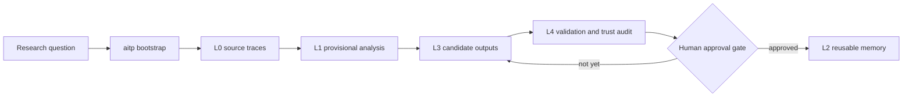

<div align="center">
  
  <h1>AITP Research Charter and Kernel</h1>
  <p><strong>Protocol-first infrastructure for building an AI Theoretical Physicist that behaves like a disciplined research participant rather than a free-form chat agent.</strong></p>
  <p>
    <a href="#quick-start">Quick Start</a> ·
    <a href="#research-model">Research Model</a> ·
    <a href="#how-you-actually-use-it">Usage</a> ·
    <a href="#runtime-support-matrix">Runtime Support</a> ·
    <a href="#read-next">Docs</a>
  </p>
</div>

<p align="center">
  
</p>

<p align="center">
  <a href="https://github.com/bhjia-phys/AITP-Research-Protocol/stargazers"></a>
  <a href="https://github.com/bhjia-phys/AITP-Research-Protocol/network/members"></a>
  <a href="https://github.com/bhjia-phys/AITP-Research-Protocol/issues"></a>
  <a href="./LICENSE"></a>
  
  
</p>

> Charter above runtime. Protocol above heuristics. Agents are executors, not the source of truth.

## Why AITP

Large models can already write research-sounding prose. That is cheap.

AITP exists to enforce the parts that are not cheap:

- evidence stays separate from conjecture;
- bounded steps replace hidden freestyle workflows;
- reusable memory is earned instead of assumed;
- failed attempts and uncertainty remain visible;
- humans stay legitimate at high-impact decision points.

## What You Get

| Surface | What it does | Where it lives |
| --- | --- | --- |
| Charter | Defines what counts as disciplined AI-assisted theoretical-physics work | `docs/CHARTER.md`, `docs/AGENT_MODEL.md` |
| Protocol contracts | Defines durable artifacts, promotion gates, and trust boundaries | `contracts/`, `schemas/` |
| Standalone kernel | Ships the public `L0-L4` runtime, audits, and CLI/MCP surfaces | `research/knowledge-hub/` |
| Adapters | Makes Codex, OpenClaw, Claude Code, and OpenCode enter through AITP | `adapters/`, `docs/INSTALL_*.md` |

## Quick Start

The fastest useful path is still the Codex path:

```bash
git clone git@github.com:bhjia-phys/AITP-Research-Protocol.git
cd AITP-Research-Protocol

python3 -m pip install -e research/knowledge-hub
aitp doctor
aitp install-agent --agent codex --scope user
```

If your system Python is externally managed:

```bash
python3 -m pip install --break-system-packages --user -e research/knowledge-hub
```

If you want a normal `codex` session inside a separate theory workspace, but
you want that session to become AITP-first instead of ad hoc:

```bash
aitp install-agent --agent codex --scope project --target-root /path/to/theory-workspace
```

That writes `.agents/skills/aitp-runtime/` into the target workspace. A fresh
clone now defaults to the repo-local kernel root at `research/knowledge-hub`,
so `aitp` works without depending on the original private integration
workspace.

## Research Model

AITP keeps research state in layers instead of flattening everything into one
chat transcript.

| Layer | Purpose | Typical contents |
| --- | --- | --- |
| `L0` | Source acquisition and traceability | papers, notes, source maps, upstream code references |
| `L1` | Provisional understanding | analysis notes, derivation sketches, concept structure |
| `L3` | Exploratory but not yet trusted outputs | candidate claims, explanatory notes, tentative reusable material |
| `L4` | Validation and adjudication | baseline runs, trust audits, implementation checks, operator decisions |
| `L2` | Long-term trusted memory | promoted knowledge, reusable workflows, stable backends |

The default non-trivial route is:

`L0 -> L1 -> L3 -> L4 -> L2`

`L2` is intentionally last. Exploratory work does not become reusable memory
just because an agent sounds confident.



## How You Actually Use It

AITP currently has two public workflows that matter.

### 1. Bare Codex In A Theory Workspace

Use this when you want a normal `codex` conversation inside a project, but you
do not want research behavior to collapse into browsing plus free-form
synthesis.

```bash
# one-time workspace install
aitp install-agent --agent codex --scope project --target-root /path/to/theory-workspace

# daily use
cd /path/to/theory-workspace
codex
```

Expected behavior:

- `codex` reads `.agents/skills/aitp-runtime/SKILL.md`;
- the first serious research action becomes `aitp bootstrap`, `aitp loop`, or `aitp resume`;
- it reads the runtime bundle before continuing;
- outputs stay in `L1`, `L3`, or `L4` until a human approves `L2` promotion.

For execution-heavy work inside an already active topic, use the stronger
wrapper:

```bash
aitp-codex --topic-slug <topic_slug> "<task>"
```

### 2. OpenClaw For Bounded Autonomous Research

Use this when you want bounded autonomous progress under heartbeat or
control-note constraints, without giving the runtime permission to invent its
own protocol.

```bash
# one-time user install
aitp install-agent --agent openclaw --scope user

# do one bounded step
aitp loop --topic-slug <topic_slug> --human-request "<task>" --max-auto-steps 1
```

Expected behavior:

- OpenClaw re-enters through `aitp loop`;
- it refreshes runtime state and decision surfaces;
- it performs one bounded next step and writes human-readable artifacts;
- anything destined for `L2` still waits for explicit human approval.

## Core Runtime Commands

If you remember only one command block, remember this one:

```bash
# install a runtime adapter
aitp install-agent --agent codex --scope user

# open a new topic
aitp bootstrap --topic "<topic>" --human-request "<task>"

# do one bounded unit of work
aitp loop --topic-slug <topic_slug> --human-request "<task>" --max-auto-steps 1

# continue an existing topic without re-bootstrap
aitp resume --topic-slug <topic_slug> --human-request "<task>"

# move mature material toward L2 only after approval
aitp request-promotion --topic-slug <topic_slug> --candidate-id <candidate_id> --backend-id <backend_id>
aitp approve-promotion --topic-slug <topic_slug> --candidate-id <candidate_id>
aitp promote --topic-slug <topic_slug> --candidate-id <candidate_id> --target-backend-root <backend_root>
```

Operating rule:

- `bootstrap` opens the topic shell;
- `loop` and `resume` do the actual bounded work;
- `L3` and `L4` are normal destinations for exploratory output;
- `L2` requires an explicit approval artifact.

## One Protocol, Three Research Lanes

AITP is deliberately general. The same kernel can drive different categories of
theoretical-physics work.

| Lane | Typical `L0` inputs | Typical `L4` work | Typical `L2` output |
| --- | --- | --- | --- |
| Formal theory and derivation | papers, definitions, prior claims, notebook traces | derivation review, proof-gap analysis, consistency checks | formal-theory backend objects, trusted derivation notes |
| Toy-model numerics | baseline papers, model specs, observables, scripts | controlled runs, convergence checks, benchmark comparison | validated workflows, benchmark notes, reusable operations |
| Code-backed algorithm development | upstream codebases, papers, existing methods | reproduction, trust audit, implementation validation | trusted methods, reusable operation manifests, backend writeback |

## Runtime Support Matrix

| Runtime | Public install path | Enforcement surface |
| --- | --- | --- |
| Codex | `aitp install-agent --agent codex` | Skill + MCP + `aitp-codex` wrapper |
| OpenClaw | `aitp install-agent --agent openclaw` | Skill + MCP bridge setup note |
| Claude Code | `aitp install-agent --agent claude-code` | Skill + command bundle |
| OpenCode | `aitp install-agent --agent opencode` | Command harness + MCP config |

Current maturity is not uniform:

- `Codex` is the strongest path today because it supports both a bare-session skill install and the stronger `aitp-codex` wrapper.
- `OpenClaw`, `Claude Code`, and `OpenCode` are already constrained through installed command and skill surfaces, but they do not yet have a wrapper as strong as `aitp-codex`.

## Design Boundaries

AITP is protocol-first. Python does not get to quietly decide the science.

The runtime is trusted to:

- materialize protocol and state artifacts;
- build deterministic projections;
- run conformance, capability, and trust audits;
- execute explicit handlers;
- expose a thin `aitp` CLI and optional `aitp-mcp` surface.

It is not trusted to:

- redefine the charter;
- silently merge evidence, derivation, and conjecture;
- promote material into `L2` without an explicit gate.

## Repository Map

```text
AITP-Research-Protocol/
├── README.md
├── AGENTS.md
├── docs/
├── contracts/
├── schemas/
├── adapters/
├── reference-runtime/
└── research/
    ├── adapters/
    │   └── openclaw/
    └── knowledge-hub/
        ├── LAYER_MAP.md
        ├── ROUTING_POLICY.md
        ├── COMMUNICATION_CONTRACT.md
        ├── AUTONOMY_AND_OPERATOR_MODEL.md
        ├── L2_CONSULTATION_PROTOCOL.md
        ├── INDEXING_RULES.md
        ├── L0_SOURCE_LAYER.md
        ├── setup.py
        ├── schemas/
        ├── knowledge_hub/
        ├── source-layer/
        ├── intake/
        ├── canonical/
        ├── feedback/
        ├── consultation/
        ├── runtime/
        └── validation/
```

## Read Next

Core charter and architecture:

- [`docs/CHARTER.md`](docs/CHARTER.md)
- [`docs/AGENT_MODEL.md`](docs/AGENT_MODEL.md)
- [`docs/CONTEXT_LOADING.md`](docs/CONTEXT_LOADING.md)
- [`docs/architecture.md`](docs/architecture.md)
- [`docs/LESSONS_FROM_GET_PHYSICS_DONE.md`](docs/LESSONS_FROM_GET_PHYSICS_DONE.md)

Kernel contract surface:

- [`research/knowledge-hub/LAYER_MAP.md`](research/knowledge-hub/LAYER_MAP.md)
- [`research/knowledge-hub/ROUTING_POLICY.md`](research/knowledge-hub/ROUTING_POLICY.md)
- [`research/knowledge-hub/COMMUNICATION_CONTRACT.md`](research/knowledge-hub/COMMUNICATION_CONTRACT.md)
- [`research/knowledge-hub/AUTONOMY_AND_OPERATOR_MODEL.md`](research/knowledge-hub/AUTONOMY_AND_OPERATOR_MODEL.md)
- [`research/knowledge-hub/L2_CONSULTATION_PROTOCOL.md`](research/knowledge-hub/L2_CONSULTATION_PROTOCOL.md)
- [`research/knowledge-hub/INDEXING_RULES.md`](research/knowledge-hub/INDEXING_RULES.md)

Install guides:

- [`docs/INSTALL_CODEX.md`](docs/INSTALL_CODEX.md)
- [`docs/INSTALL_OPENCLAW.md`](docs/INSTALL_OPENCLAW.md)
- [`docs/INSTALL_CLAUDE_CODE.md`](docs/INSTALL_CLAUDE_CODE.md)
- [`docs/INSTALL_OPENCODE.md`](docs/INSTALL_OPENCODE.md)
- [`docs/UNINSTALL.md`](docs/UNINSTALL.md)

Protocol objects:

- [`contracts/research-question.md`](contracts/research-question.md)
- [`contracts/candidate-claim.md`](contracts/candidate-claim.md)
- [`contracts/derivation.md`](contracts/derivation.md)
- [`contracts/validation.md`](contracts/validation.md)
- [`contracts/operation.md`](contracts/operation.md)
- [`contracts/promotion-or-reject.md`](contracts/promotion-or-reject.md)

## Current Status

The repository is already more than a static protocol archive:

- it ships a standalone installable kernel under `research/knowledge-hub`;
- it exposes fixed `L0-L4` research surfaces plus `consultation/`, `runtime/`, and `schemas/`;
- it installs user-side wrappers for the main target runtimes;
- it includes an explicit human approval gate before `L2` promotion;
- it can bridge into the standalone `Theoretical-Physics-Knowledge-Network` formal-theory backend without hard-wiring one private knowledge base as the only destination.

Still in progress:

- OpenClaw and OpenCode should continue moving toward a wrapper as opinionated as `aitp-codex`;
- the standalone workspace-seeding path for some runtimes is still less mature than the CLI wrapper path;
- multi-runtime smoke testing should keep expanding.

## See Also

- [`docs/design-principles.md`](docs/design-principles.md)
- [`docs/roadmap.md`](docs/roadmap.md)
- [`docs/benchmark-cases.md`](docs/benchmark-cases.md)
- [`reference-runtime/README.md`](reference-runtime/README.md)
