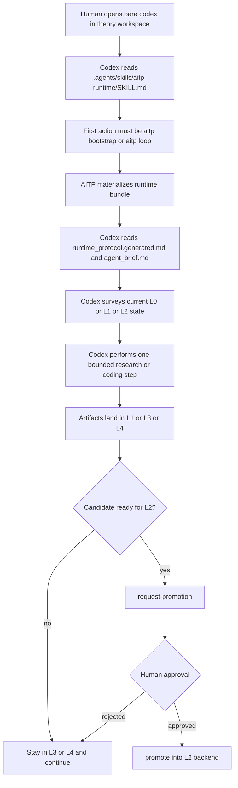
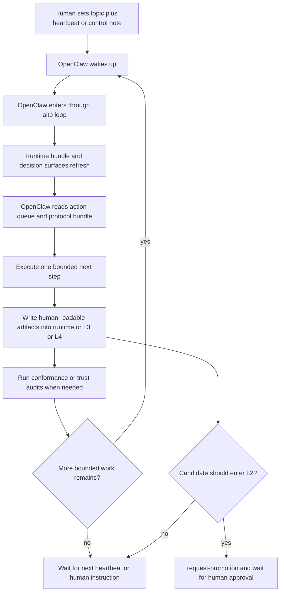
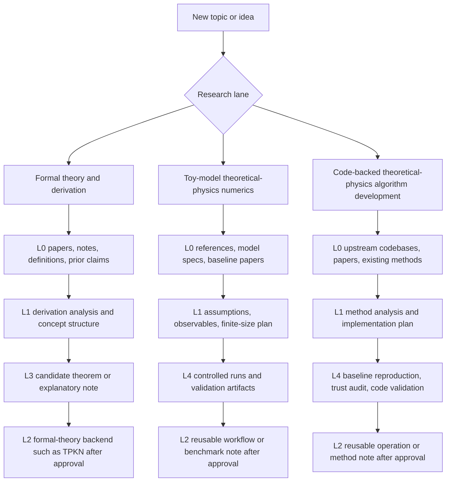
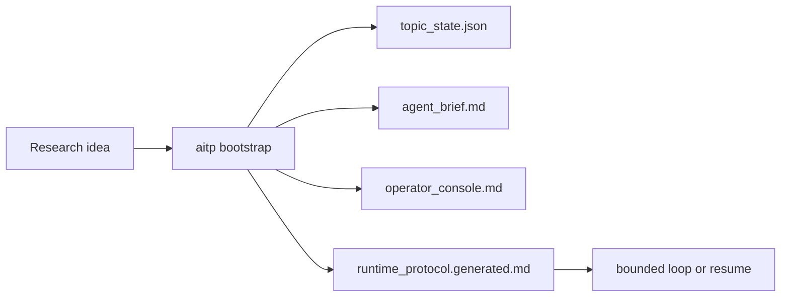
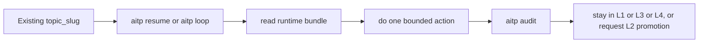
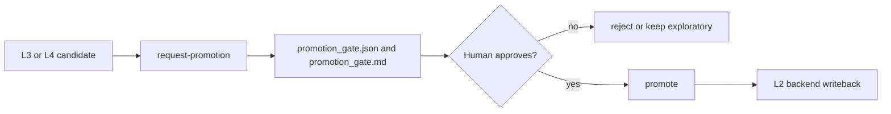

<div align="center">
  
  <h1>AITP Research Charter and Kernel</h1>
  <p><strong>Protocol-first infrastructure for building an AI Theoretical Physicist that behaves like a disciplined research participant rather than a free-form chat agent.</strong></p>
  <p>
    <a href="#quick-start">Quick Start</a> ·
    <a href="#core-research-model">Research Model</a> ·
    <a href="#how-you-actually-use-it">Usage</a> ·
    <a href="#agent-support-matrix">Runtime Support</a> ·
    <a href="#public-docs">Docs</a>
  </p>
</div>

<p align="center">
  
</p>

<p align="center">
  <a href="https://github.com/bhjia-phys/AITP-Research-Protocol/stargazers"></a>
  <a href="https://github.com/bhjia-phys/AITP-Research-Protocol/network/members"></a>
  <a href="https://github.com/bhjia-phys/AITP-Research-Protocol/issues"></a>
  <a href="./LICENSE"></a>
  
  
</p>

> Charter above runtime. Protocol above heuristics. Agents are executors, not the source of truth.

## At A Glance

| Surface | Role | Current public shape |
| --- | --- | --- |
| Charter | Defines what serious AI-assisted theoretical-physics work should respect | `docs/CHARTER.md`, `docs/AGENT_MODEL.md` |
| Kernel | Provides stable `L0-L4` layer boundaries, audits, and promotion gates | `research/knowledge-hub/` |
| Adapters | Forces concrete runtimes to enter through the protocol instead of ad hoc behavior | Codex, OpenClaw, Claude Code, OpenCode |

## What This Repository Is

AITP stands for **AI Theoretical Physicist**.

This repository now exposes a public research charter plus a standalone AITP
kernel:

- the **charter** that defines what serious AI-assisted theoretical-physics work
  should respect;
- the **protocol contracts** that define the durable artifacts and gates;
- a **standalone installable kernel** with fixed `L0-L4` directories, schemas,
  and cross-layer protocol surfaces;
- a **minimal runtime** that materializes state, runs audits, and executes
  explicit handlers inside that kernel;
- **reference adapters** for Codex, OpenClaw, Claude Code, and OpenCode.

The public repository is intentionally general.
It ships the fixed layer surfaces, contracts, and runtime boundaries, but not a
single fixed scientific agenda.
Different users should be able to populate the same `L0-L4` structure for:

- formal theory and derivation-heavy research;
- toy-model theoretical-physics numerics;
- code-backed theoretical-physics algorithm development.

The intended rule is:

- the charter is above the runtime;
- the protocol is above agent heuristics;
- agents are executors and adapters, not the source of truth.

## Why This Exists

Large models can produce fluent research language. That is not enough.

AITP is built to preserve the things that matter for real research:

- evidence before speculation;
- durable artifacts instead of chat residue;
- explicit uncertainty instead of false confidence;
- reusable knowledge instead of one-off output;
- visible validation and rejection paths;
- human-readable state that later agents and humans can audit.

## Core Research Model

AITP currently works through an `L0-L4` research structure:

- `L0`: source entry, survey, and acquisition substrate
- `L1`: analysis and provisional understanding
- `L2`: long-term reusable knowledge and active memory
- `L3`: exploratory conclusions, candidate claims, and not-yet-trusted reusable material
- `L4`: planning, execution, validation, and adjudication

The default non-trivial route remains:

`L0 -> L1 -> L3 -> L4 -> L2`

What matters is not only the layer map, but the rule that an agent may not
silently decide its own research workflow. It must follow durable contracts.
Each clone may extend the content inside these layers and may bridge external
formal-theory note systems, software repositories, or result stores, but the
directory and contract surfaces should remain stable.

## Quick Start

The shortest useful install path is the Codex path:

```bash
git clone git@github.com:bhjia-phys/AITP-Research-Protocol.git
cd AITP-Research-Protocol

python3 -m pip install -e research/knowledge-hub
aitp doctor
aitp install-agent --agent codex --scope user
```

If your system Python is externally managed, use:

```bash
python3 -m pip install --break-system-packages --user -e research/knowledge-hub
```

If you want a separate theory workspace to run bare `codex` in an AITP-first
way, install the project skill into that workspace root:

```bash
aitp install-agent --agent codex --scope project --target-root /path/to/theory-workspace
```

That writes `.agents/skills/aitp-runtime/` under the target workspace so a
normal `codex` session there sees an AITP-first research rule instead of
starting from ad hoc browsing.

The public runtime now defaults to the repo-local kernel root:

- `research/knowledge-hub`

So a fresh clone no longer depends on the original private integration
workspace just to get `aitp` running.

## How You Actually Use It

AITP currently has two primary public-facing usage patterns.

### 1. Bare Codex in a Theory Workspace

Use this when you want to open a normal `codex` session inside a theory project
directory, but you want research work to be forced into AITP instead of direct
browsing and free-form synthesis.

```bash
# one-time workspace install
aitp install-agent --agent codex --scope project --target-root /path/to/theory-workspace

# normal daily use
cd /path/to/theory-workspace
codex
```

Inside `codex`, you can speak normally. For example:

```text
Start a new AITP topic about operator growth in a toy spin chain. Do a bounded first pass only.
```

```text
Resume topic <topic_slug> and continue the next bounded AITP step. Do not jump directly to conclusions.
```

The expected behavior is:

- `codex` reads `.agents/skills/aitp-runtime/SKILL.md`;
- the first serious research action becomes `aitp bootstrap`, `aitp loop`, or `aitp resume`;
- `codex` reads the runtime bundle before continuing;
- outputs stay in `L1`, `L3`, or `L4` until a human approves `L2` promotion.

For execution-heavy work inside an already active topic, the stronger wrapper is:

```bash
aitp-codex --topic-slug <topic_slug> "<task>"
```

### 2. OpenClaw for Bounded Autonomous Research

Use this when you want OpenClaw to keep advancing a topic through bounded loop
steps, usually under heartbeat or control-note constraints.

```bash
# one-time user install
aitp install-agent --agent openclaw --scope user

# bounded runtime entry
aitp loop --topic-slug <topic_slug> --human-request "<task>" --max-auto-steps 1
```

The expected behavior is:

- OpenClaw re-enters through `aitp loop` instead of inventing its own workflow;
- it reads the runtime protocol bundle and decision surfaces;
- it performs one bounded next step, writes human-readable artifacts, and re-enters later;
- anything destined for `L2` still waits for explicit human approval.

## Workflow Diagrams

AITP is designed so different runtimes and different research lanes can share
the same `L0-L4` contract instead of inventing different hidden workflows.

### 1. Bare Codex Inside a Theory Workspace

Use this when you want a normal `codex` conversation inside a project folder,
but you want research work to enter through AITP instead of direct browsing.



### 2. OpenClaw Plus Heartbeat Autonomous Research

Use this when you want OpenClaw to keep advancing a topic in bounded steps,
while a human still controls direction changes and `L2` admission.



### 3. Three Research Lanes Under One Protocol

The same layer protocol can support three different categories of theoretical
physics work.



## Runtime Workflows At A Glance

### Workflow A: Start a New Topic



### Workflow B: Continue an Existing Topic



### Workflow C: L2 Admission Gate



## Core Runtime Commands

For most users there are only four recurring AITP operations:

```bash
# 1. create or refresh a topic shell
aitp bootstrap --topic "<topic>" --human-request "<task>"

# 2. do one bounded unit of topic work
aitp loop --topic-slug <topic_slug> --human-request "<task>" --max-auto-steps 1

# 3. continue an existing topic without re-bootstrap
aitp resume --topic-slug <topic_slug> --human-request "<task>"

# 4. move a mature candidate into L2 only after human approval
aitp request-promotion --topic-slug <topic_slug> --candidate-id <candidate_id> --backend-id <backend_id>
aitp approve-promotion --topic-slug <topic_slug> --candidate-id <candidate_id>
aitp promote --topic-slug <topic_slug> --candidate-id <candidate_id> --target-backend-root <backend_root>
```

The practical rule is:

- use `bootstrap` to open a topic;
- use `loop` or `resume` for actual bounded progress;
- keep exploratory or not-yet-approved material in `L3` or `L4`;
- only move into `L2` after an explicit human approval artifact exists.

## Agent Support Matrix

| Runtime | Public install path | Enforcement surface |
|---------|----------------------|---------------------|
| Codex | `aitp install-agent --agent codex` | Skill + MCP + `aitp-codex` wrapper |
| OpenClaw | `aitp install-agent --agent openclaw` | Skill + MCP bridge setup note |
| Claude Code | `aitp install-agent --agent claude-code` | Skill + command bundle |
| OpenCode | `aitp install-agent --agent opencode` | Command harness + MCP config |

Current strength differs by runtime:

- `Codex` is the strongest path right now because it supports both an
  AITP-first bare-session skill install and the stronger `aitp-codex` wrapper.
- `OpenCode`, `Claude Code`, and `OpenClaw` are currently constrained through
  installed command/skill surfaces plus conformance requirements, not through an
  equally strong native wrapper binary yet.

## What Python Still Does

AITP is protocol-first, not “Python decides the science”.

The runtime is only trusted to do the following:

- materialize protocol and state artifacts;
- build deterministic projections;
- run conformance, capability, and trust audits;
- execute explicit tool handlers;
- expose a thin `aitp` CLI and optional `aitp-mcp` surface.

It should not become the hidden source of scientific judgment.

## Repository Map

```text
AITP-Research-Protocol/
  README.md
  AGENTS.md
  docs/
  contracts/
  schemas/
  adapters/
  research/
    adapters/
      openclaw/
    knowledge-hub/
      LAYER_MAP.md
      ROUTING_POLICY.md
      COMMUNICATION_CONTRACT.md
      AUTONOMY_AND_OPERATOR_MODEL.md
      L2_CONSULTATION_PROTOCOL.md
      INDEXING_RULES.md
      L0_SOURCE_LAYER.md
      setup.py
      schemas/
      knowledge_hub/
      source-layer/
      intake/
      canonical/
      feedback/
      consultation/
      runtime/
      validation/
```

## Public Docs

Start here:

- charter: [`docs/CHARTER.md`](docs/CHARTER.md)
- agent boundary: [`docs/AGENT_MODEL.md`](docs/AGENT_MODEL.md)
- context loading: [`docs/CONTEXT_LOADING.md`](docs/CONTEXT_LOADING.md)
- architecture: [`docs/architecture.md`](docs/architecture.md)
- lessons from `get-physics-done`: [`docs/LESSONS_FROM_GET_PHYSICS_DONE.md`](docs/LESSONS_FROM_GET_PHYSICS_DONE.md)

Kernel contract surface:

- layer map: [`research/knowledge-hub/LAYER_MAP.md`](research/knowledge-hub/LAYER_MAP.md)
- routing policy: [`research/knowledge-hub/ROUTING_POLICY.md`](research/knowledge-hub/ROUTING_POLICY.md)
- communication contract: [`research/knowledge-hub/COMMUNICATION_CONTRACT.md`](research/knowledge-hub/COMMUNICATION_CONTRACT.md)
- autonomy/operator model: [`research/knowledge-hub/AUTONOMY_AND_OPERATOR_MODEL.md`](research/knowledge-hub/AUTONOMY_AND_OPERATOR_MODEL.md)
- L2 consultation: [`research/knowledge-hub/L2_CONSULTATION_PROTOCOL.md`](research/knowledge-hub/L2_CONSULTATION_PROTOCOL.md)
- indexing rules: [`research/knowledge-hub/INDEXING_RULES.md`](research/knowledge-hub/INDEXING_RULES.md)

Install guides:

- OpenClaw: [`docs/INSTALL_OPENCLAW.md`](docs/INSTALL_OPENCLAW.md)
- Codex: [`docs/INSTALL_CODEX.md`](docs/INSTALL_CODEX.md)
- Claude Code: [`docs/INSTALL_CLAUDE_CODE.md`](docs/INSTALL_CLAUDE_CODE.md)
- OpenCode: [`docs/INSTALL_OPENCODE.md`](docs/INSTALL_OPENCODE.md)
- Uninstall: [`docs/UNINSTALL.md`](docs/UNINSTALL.md)

Protocol objects:

- [`contracts/research-question.md`](contracts/research-question.md)
- [`contracts/candidate-claim.md`](contracts/candidate-claim.md)
- [`contracts/derivation.md`](contracts/derivation.md)
- [`contracts/validation.md`](contracts/validation.md)
- [`contracts/operation.md`](contracts/operation.md)
- [`contracts/promotion-or-reject.md`](contracts/promotion-or-reject.md)

## Current Status

The repository is now more than a pure protocol archive:

- it remains charter-and-protocol first;
- it now ships a standalone installable kernel under `research/knowledge-hub`;
- it now ships fixed `L0-L4` directories plus `consultation/`, `runtime/`, and `schemas/`;
- it can install user-side wrappers for the main target runtimes;
- it can bridge separate human-note and software backends into `L2` without hard-wiring one private knowledge base as the only target;
- it now includes an explicit human approval gate before `L2` promotion and a
  public bridge into the standalone `Theoretical-Physics-Knowledge-Network`
  formal-theory backend;
- it still keeps stronger private integration claims honest.

What is still incomplete:

- OpenClaw and OpenCode do not yet have a wrapper as hard as `aitp-codex`;
- the reference OpenClaw plugin assets are present, but the standalone
  workspace-seeding path is still less mature than the CLI-based wrapper path;
- full multi-runtime smoke testing should continue to expand.

## See Also

- [`docs/design-principles.md`](docs/design-principles.md)
- [`docs/roadmap.md`](docs/roadmap.md)
- [`docs/benchmark-cases.md`](docs/benchmark-cases.md)
- [`reference-runtime/README.md`](reference-runtime/README.md)
