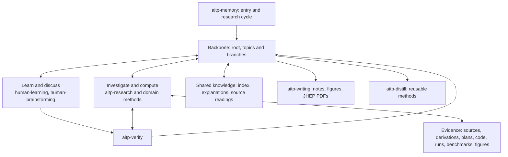

# AITP

Development version 1.2.3: article-centred research memory, research and writing guidance,
and direct Skill distillation. The bundle contains instructions and
optional manuscript assets, with no runtime. This development tree adds the research
backbone (a root note, topic trees, reachability, seeds and a visible close), a single
entry with a research cycle, verification, computational and benchmark procedures,
synthesis across sources, reviewed plans, hand-offs and parallel work, main and
supporting note standards, source-based learning and domain methods, beyond the
published 1.1.0 release below. Real research examples are pending review.

Install the versioned release in **Hakimi** with:

```text
/plugins install https://github.com/bhjia-phys/AITP-Research-Protocol/releases/download/v1.1.0/aitp-1.1.0.zip
```

For **Codex**, use the repository marketplace:

```sh
codex plugin marketplace add bhjia-phys/AITP-Research-Protocol --ref v1.1.0
codex plugin add aitp@aitp-protocol
```

For **Claude Code**, run from the development repository root:

```sh
claude plugin marketplace add .
claude plugin install aitp@aitp-protocol --scope user
```

Claude support is newer than the published `v1.1.0` release. Its native manifest
is `.claude-plugin/plugin.json`; the seven core Skills load from `skills/`, and
the manifest additionally exposes the nested LibRPA method. The Skill files and
their relative reference links are shared with Codex and Hakimi. Check the
loaded inventory with `claude plugin details aitp`. In a new session, ordinary
research requests can activate relevant Skills; `/aitp:aitp-memory` is also
available as an explicit entry point. Installation does not rewrite research notes.

Start a new host thread after installation.

## The architecture: a backbone and the processes that grow it

`research.md` is the researcher's long-term memory and the backbone of the research. Each
one is a developing article about the question at its own level: a root note for the
whole research workspace (directions, cross-topic connections, seeds of new ideas, agreed
agenda and standing agreements), topic notes, and branch notes inside topics. Every
retained paper, derivation, experiment and output has one home and a link path from the
root and from the note that uses it.

The seven Skills are processes on that backbone. Each says what it reads, what it writes
back and where, and what it can trigger next. They reuse one recovered context rather
than restarting the cycle at each cross-reference. The root and branch details are
loaded only when needed through memory's references.

- [aitp-memory](skills/aitp-memory/SKILL.md) is the single entry for research work and
  substantive physics discussions. It opens with the
  [six-line research cycle](skills/aitp-memory/SKILL.md#the-research-cycle). In summary:
  recover the request and agreement; read the whole argument before revising it; explain
  what the task should settle; do the work and check consequential claims; retain outcomes
  in their homes and repair affected uses; close with the supported answer and the
  warranted next move. It also keeps the root, topic trees, seeds and plans, answers
  status questions and resumes on "continue".
- [aitp-research](skills/aitp-research/SKILL.md) guides investigation: derivations,
  synthesis across sources, discriminating calculations, implementation, debugging,
  benchmark suites and literature, with domain methods for GW/LibRPA and quantum chaos.
- [aitp-verify](skills/aitp-verify/SKILL.md) checks a consequential claim, number,
  reference or document before it is relied on, and assesses another model's review.
- [aitp-writing](skills/aitp-writing/SKILL.md) develops research notes and, when requested,
  LaTeX manuscripts and PDFs for formal theory, numerical studies and mixed work.
- [aitp-human-learning](skills/aitp-human-learning/SKILL.md) adapts explanations to the
  learner's question and difficulty, without compulsory quizzes.
- [aitp-human-brainstorming](skills/aitp-human-brainstorming/SKILL.md) resolves the
  researcher's consequential choices and turns ideas into seeds or agreed branches.
- [aitp-distill](skills/aitp-distill/SKILL.md) turns a demonstrated procedure into a
  focused local Skill.



Routine work and ordinary organization proceed without repeated permission: placing
files, creating supporting notes and run folders, recording seeds, building the home of an
agreed branch. A new line of investigation, a material change of objective, an expensive
campaign, an installation, a cluster submission or a publication is proposed first, unless
the current request or an existing applicable agreement already covers it; a standing
agreement recorded in the root is one such agreement. There is no dispatcher: a task may
pass through several Skills, and a directly opened Skill applies the same cycle.
Consequential algorithm choices, including numerical-method changes at fixed physical
equations, are surfaced before dependent edits or runs. Give concrete alternatives,
a recommendation and the relevant accuracy/cost tradeoffs; wait for the researcher's
choice unless already settled or explicitly delegated. This is AITP's default and
needs no personal agreement entry. Implementation and bug fixes within the chosen
method continue without repeated questions.

Keep general procedures in the Skills. Workspace instructions hold local context,
personal preferences and genuine overrides; root standing agreements hold concrete
workspace-wide delegations or exceptions. Refer to the protocol instead of copying
its general rules into those files.

These seven Skills are available in this development tree. The published 1.1.0 release
has the four original Skills. Interaction is conditional throughout, not two extra
required workflow stages.

The first note and substantive revisions use
[main-note writing](skills/aitp-writing/references/research-note.md): a concise,
connected argument with decisive conditions, useful failures and uncertainty,
linked to full derivations and assets. New notes can use an English Markdown template
for a [compact argument](skills/aitp-writing/assets/research-letter.md),
[theory or learning](skills/aitp-writing/assets/research-theory.md), or
[computational and mixed work](skills/aitp-writing/assets/research-computational.md).
Their [journal sources](skills/aitp-writing/references/journal-templates.md) explain
what was adapted from PRL, PRX, JHEP and PRB. These are article structures, with
flexible headings and no prescribed length. Memory and writing edit the same account.
It should let a returning agent choose the next useful inference: why the main
line matters, what each branch contributes and which completed route need not
be repeated. A folder map alone does not express these scientific relationships. After changing an
argument, follow its evidence route into the owning explanation and actual source or
numerical assets. Check known users of a changed branch conclusion, including another
parent or sibling; valid links alone do not establish that their meanings agree.

During use, they also [repair an older main note](skills/aitp-memory/SKILL.md#repair-an-outdated-main-note-during-use)
when its current organization obscures the supported answer, conditions, evidence
or continuation. Within the current editing scope, this needs no separate
maintenance request or new scientific result. Preserve useful reasoning and
history; different headings alone require no rewrite. A usable note, unchanged
revisit or explicit read-only request does not trigger a maintenance write.
This is upkeep during research, not a background or installation-time migration.

[Side investigations](skills/aitp-writing/references/supporting-notes.md#follow-a-side-investigation)
keep their motivation, agreed objective and approach, and connection to the
originating question, even before results exist. Research guides discussion and
agreement before independent branches or material changes of stage objective or
route; work within an existing agreement continues without repeated confirmation.
Memory retains the agreement in the branch's `research.md`. An agreed independent
research branch gets its own folder and main note unless a suitable home already
exists; short diagnostics stay with the existing question. The nearest README maps
the folders, while the originating and branch main notes link each other and
explain their scientific relationship. As branches develop, memory's
[topic-tree checks](skills/aitp-memory/SKILL.md#keep-the-topic-tree-clear) keep
each branch's evidence in the branch and its implication in the parent, and carry
a changed branch answer into the parent at handoff. Writing connects plans, derivations,
implementation and results there, splitting detail only when useful. Reuse
existing notes and asset locations through links. Authorized organization can
establish clear branch homes without another approval; unresolved choices that
would change scientific scope use human brainstorming first.

Use [supporting-note writing](skills/aitp-writing/references/supporting-notes.md)
for detailed explanations and [citation conventions](skills/aitp-writing/references/citations.md)
for equations and evidence links. Reusable understanding can live in an optional
[shared collection outside topics](skills/aitp-memory/references/shared-knowledge.md).
It holds:
- atoms, each one concept, theorem, technique, example or result;
- source readings, as a paper map plus section notes;
- stories for learning topics;
- optional author collections.

One index lists these by area. Read the index once at the start of a theoretical
derivation, a conceptual question, or a reading or study task, including theory within
numerical work. Check it before creating an atom. Reuse needs no write.

At a natural pause, retain a new explanation, technique (theoretical or numerical) or
correction that another question could use. Decide this in the same pass as the topic
note, even if the work needed no lookup. It enters as an index row
that cites the research note and names the question rather than restating the result,
marked provisional. A shared atom is written from it only after
the researcher confirms the result. Review rows when their cited note changes; update
only affected locations, scope, support, review state or qualifications.
Link prerequisites, related ideas and applications in ordinary
prose, following only what the current argument needs.

For learning interaction, use
[aitp-human-learning](skills/aitp-human-learning/SKILL.md); for exposition, use
[learning from sources](skills/aitp-writing/references/learning.md).
The main note explains the developing whole-topic argument; a supporting note
lets its reader follow and use a specific result from stated prerequisites.
Choose whether a passage should support understanding, reproduction or proof.
Expand a primary lecture around concrete difficulties and use reader feedback
to improve the next explanation. A teaching PDF retains that purpose and depth
when using journal typography. Neither an authored explanation nor silence
establishes learner understanding. No learning ledger is required.

[Corrections follow affected claims](skills/aitp-writing/references/supporting-notes.md#correct-claims-and-keep-earlier-routes-findable)
across main and supporting notes. Useful material omitted from the main account
can remain linked from an existing README or index. Known errors or unresolved
objections stay visible where the old material is read, with corrected treatment
linked when available. No automatic synchronization or deletion is implied.

Use normal read, search and edit tools. There is no ledger command, adapter
contract, automatic session hook or required service. Host permissions govern
execution and publication. Skills guide behavior; they cannot guarantee activation,
crash recovery or scientific correctness.

For a persistent workspace instruction, a researcher may put the following in
its existing `AGENTS.md` (`CLAUDE.md` for Claude Code), or state it in the conversation:

> For research work and substantive physics discussions, begin with aitp-memory and
> its research cycle; reuse current context for follow-ups. The root `research.md` holds
> the directions, connections, seeds and standing agreements; topic and branch notes hold
> their arguments. When a result arrives, replace the passage whose meaning it changes
> rather than appending an update; full setups, repeated runs and job states go in the
> supporting note or run report. Close each task by saying what is supported, where it
> was saved and what it warrants next.

This assumes AITP is available in the host. It is optional workspace guidance,
not a new required file. The Skill descriptions and cross-references request
the same entry; Hakimi also supplies an entry reminder from the plugin manifest.
These are instructions for the agent, not an executable router or session hook.

For a new or unfamiliar topic, use
[starting or organizing a topic](skills/aitp-memory/references/starting-a-topic.md).
Clarify consequential uncertainty before writing around it; use earlier answers
and proceed directly when the scope is clear.
The [example status](examples/README.md) explains the replacement of the former
teaching exercise by reviewable research examples.
[Asset guidance](skills/aitp-memory/references/local-assets.md) explains how the
README maps material folders and the main argument links detailed notes and their
assets. It offers optional layouts for new topics and shared development;
reuse established locations and create folders for agreed independent questions,
not as empty asset templates.
For unfamiliar related work, [browse directory entries and note titles first](skills/aitp-memory/references/local-assets.md#browse-nearby-topics-and-shared-knowledge),
then search and read selected notes. Short scope descriptions help choose a note;
known useful links can be followed directly. Reuse the located context within the task.
Its [numerical guidance](skills/aitp-memory/references/numerical-assets.md)
distinguishes working source, optional worktrees, builds, tests and scientific
runs. General procedures live in the research Skill's
[domain library](skills/aitp-research/references/method-library.md), starting with
[developing LibRPA](skills/aitp-research/methods/librpa/developing-librpa/SKILL.md)
for source analysis and numerical development.
They are linked for reading on demand, without another registry. Codex can also
list nested method Skills directly; Claude Code explicitly exposes the LibRPA
method in its manifest, and Hakimi exposes the seven containing bundles.
The seven core roles therefore need not equal the host's total selectable count.
Research examples and unpublished evidence follow the author's publication
permissions; adding a general method does not publish its originating project.
After consequential work reveals a transferable choice, diagnostic sequence,
failure-prevention method or correction to a procedure, use `aitp-distill` to
create or revise a local Skill within scope. One worked case can support a
narrow method with explicit limits; do not wait for a separate request or
repeat failure. Insufficiently supported candidates stay in research notes.
See the [repository README](https://github.com/bhjia-phys/AITP-Research-Protocol/tree/v1.1.0)
for further usage guidance.

When a researcher has selected an exemplar author in their workspace, recover that
choice across sessions. A substantial new argument or reorganization reads the relevant
organization record and a matching original passage, then adapts a concrete decision
under checked assumptions. Routine prose edits need no fresh exemplar read. This guidance
supports reasoning and exposition; it does not certify imitation of an author's insight.
